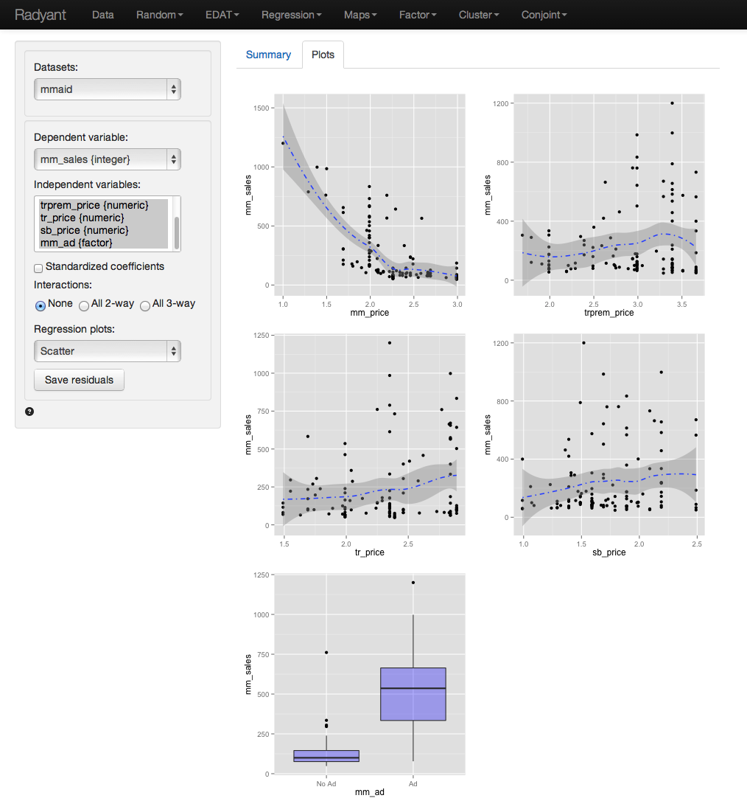

All example files can be loaded from Data > Manage. Click the 'examples' radio button and press 'Load examples'.

#### Example 1:  Catalog sales

We have access to data from a company selling men’s and women’s apparel through mail-order catalogs (dataset 'catalog'). The company maintains a database on past and current customers’ value and characteristics. Value is determine as the total$ sales to the customer in the last year. The data are a random sample of 200 customers from the company’s database. The r-data contains a data frame with 200 observations on 4 variables

- Sales =  Total sales (in $) to a household in the past year
- Income = Household income ($1000) 
- HH.size = Size of the household (# of people) 
- Age = Age of the head of the household

The catalog company is interested in redesigning their Customer Relationship Management (CRM) strategies. We will proceed in two steps: 

1. Estimate a regression model using last year’s sales total. Dependent variable: sales total for each of the 200 households; explanatory variables: household income (measured in thousands of dollars), size of household, and age of the household head. The data-set is given in the ‘catalog’ data file. Interpret each of your estimated coefficients. Also provide a statistical evaluation of the model as a whole.
 
2. Which explanatory variables are significant predictors of customer value (use a 95% confidence level)? 

Answer:

Output from Radyant (Regression > Linear (OLS)) is provided below:

The F-statistic suggests that the regression model as a whole explains a significant amount of variance in Sales. The calculated F-value is equal to 32.33 and has a very small p-value (< 0.001). The amount of variance in sales explained by the model is equal to 33.1%

The null and alternate hypothesis for the F-test test can be formulated as follows:
H0: All regression coefficients are equal to 0
Ha: At least one regression coefficient is not equal to zero

The coefficients from the regression can be interpreted as follows:

For an increase in income of $1000 we expect, on average, to see an increase in sales of $1.7754, keeping all other factors constant.
- For an increase in household size of 1 person we expect, on average, to see an increase in sales of $22.1218, keeping all other factors constant.
- For an increase in the age of the head of the household of 1 year we expect, on average, to see an increase in sales of $0.45, keeping all other factors constant.

For each of the independent variables the following null and alternate hypotheses can be formulated:
H0: The coefficient associated with independent variable X is equal to 0
Ha: The coefficient associated with independent variable X is not equal to 0

The coefficients for 'Income' and ’HH.size' are both significant (p-values < 0.05), i.e., we can reject H0 for each of these coefficients. The coefficient for Age HH is not significant (p-value > 0.05), i.e., we cannot reject H0 for Age HH. We conclude that a change in Age of the household head does not lead to a significant change in sales.

#### Example 2: Ideal data for regression 

The data 'ideal' contains simulated data that is very useful to demonstrate what data for and residuals from a regression should ideally look like.  The r-data file contains a data-frame with 1000 observations on 4 variables. y is the dependent variable and x1, x2, and x3 are independent variables. The plots shown below can be used as a bench mark for regressions on real world data. We will use Regression > Linear (OLS) to conduct the analysis. First go the the Plots tab and select y as the dependent variable and x1, x2, and x3 as the independent variables.

y, x2, and x3 appear roughly normally distributed whereas x1 appears roughly uniformly distributed. No indication of outliers or severely skewed distributions.

In the plot of correlations there are clear associations among the dependent and independent variables as well as among the independent variables themselves. Recall that in an experiment the x's of interest would have a zero correlation. The scatter plots in the lower-diagonal part of the plot show that the relationships between the variables are (approximately) linear.

The scatter plots of y (the dependent variable) against each of the independent variables confirm the insight from the correlation plot. The line fitted through the scatter plots is sufficiently flexible that it would pickup any non-linearities. The lines are, however, very straight suggesting that a basic linear will likely be appropriate.

The dashboard of four residual plots looks excellent, as we might expect here. True values and predicted values from the regression form a straight line with random scatter. The residuals (i.e., the differences between the actual data and the values predicted by the regression) show no pattern and are randomly scattered around a horizontal axis. If a pattern were visible in the Residual vs Row order plot we might be concerned about auto-correlation. Again, the residuals are nicely scattered about a horizontal axis. Finally, the Q-Q plot shows a nice straight and diagonal line, evidence that the residuals are normally distributed.

The final diagnostic we will discuss is a set of plots of the residuals versus the independent variables (or predictors). There is no indication of any trends or heteroscedasticity. Any patterns in these plots would be cause for concern. There are also no outliers, i.e., points that are far from the main cloud of data points.

Since the diagnostics look good, we can draw inferences from the regression. First, the model is significant as a whole: the p-value on the F-statistic is less than 0.05 therefore we reject the null hypothesis that all three variables in the regression have slope equal to zero. Second, each variable is statistically significant: for example, the p-value on the t-statistic for x1 is less than 0.05 therefore we reject the null hypothesis that x1 has slope equal to zero when x2 and x3 are also in the model (i.e., 'holding all other variables constant').

Increases in x1 and x3 are associated with increases in y whereas increases in x2 are associated with decreases in y. Since these are simulated data the scale of the variables is not relevant. In the scatterplot, it looked like increases in x3 were associated with decreases in y. What explains the difference (hint: consider the correlation plots)?

#### Example 3: Linear or log-log regression?

In marketing both linear and log-log regression are very common. In this example we will look for evidence in the data and residuals that may suggest one or the other specification may be more appropriate for the available data.

The data 'mmaid' contains 116 weeks of data on sales of minute maid orange juice, prices for minute maid and some of it's competitors, and a dummy variable that indicates if minute maid was featured in a give week. A more complete description of the data and variables is available from the Data > Manage page. Select the variable 'sales' as the dependent variable and 'mm_price', 'trprem_price', 'tr_price', 'sb_price', and 'mm_ad' as the independent variables. Before looking at the parameter estimates from the regression go to the Plots tab to take a look at the data and residuals. Below are the set of histograms for the variables in the. As is quite common in marketing data sales seems skewed to the left while prices for the national brands (i.e., minute maid, tropicana premium, and tropicana) are somewhat skewed to the right. The orange juice market is characterized by frequent price promotions after which prices return to their regular levels. This could explain both the skewness of price and sales if the promotions lead to big spikes in sales. The distribution for the store brand's prices (sb_price) seems more balanced.

In the plot of correlations there are clear associations among the dependent and independent variables, particularly mm_price and mm_ad, while the correlations between the independent variables themselves are not that large.

The scatter plots of sales (the dependent variable) against each of the independent variables is not as clear as for the 'ideal' data in example 2. The line fitted through the scatter plots is sufficiently flexible to pickup any non-linearities. While the lines for trprem_price, tp_price, and sb_price seem reasonably straight the line for sales versus mm_price does not. This suggests that a basic linear regression on these data may not be appropriate.

The dashboard of four residual plots looks less than stellar. The true values and predicted values from the regression form a curved line. The residuals (i.e., the differences between the actual data and the values predicted by the regression) show an even more distinct pattern as the residuals are clearly not randomly scattered around a horizontal axis. While Residual vs Row order plot does not look perfectly straight there is no clear pattern and auto-correlation is not likely to be a big concern. Finally, while for the 'ideal' data in example 2 the Q-Q plot showed a nice straight and diagonal line. Here the dots separate from the line at left and right extremes, evidence that the residuals are not normally distributed.

The final diagnostic we will discuss is a set of plots of the residuals versus the independent variables (or predictors). While the plots for competitors' price and mm_ad look reasonable, the plot of mm_price versus regression residuals does not as there is a clear non-linear pattern. 

Since the diagnostics do not look good, we should not draw inferences from this regression. A log-log or semi-log specification might be preferable.
